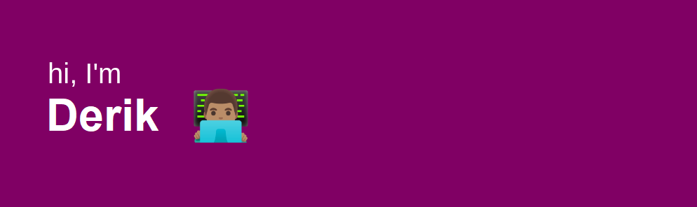
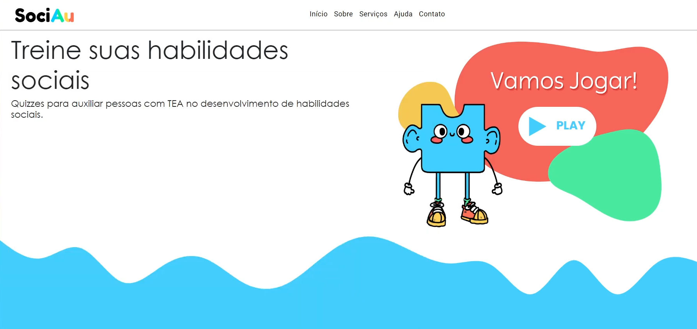
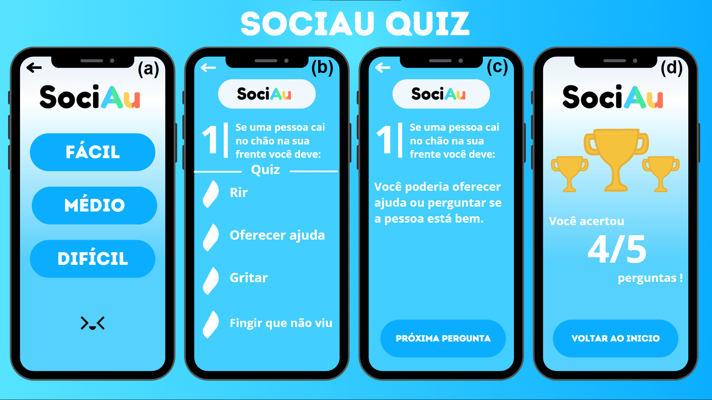

## Bem-Vindo

  

 

## ⭐️ Sobre mim

Estou estudando <b>Ciência da Computação</b> pela Universidade Estadual do Centro Oeste (Unicentro) e atualmente estou em busca de uma oportunidade.
  

  

    <table>
      <tr>
        <td><b>🎓 Cientista da Computação</b></td>
      </tr>
      <tr>
        <td></td>
      </tr>
    </table>
  

 
 &nbsp;  &nbsp;

## My Skills

#### Main Stack:

&nbsp;
&nbsp;
&nbsp;
&nbsp;
&nbsp;
&nbsp;

&nbsp;
&nbsp;

## Principais Projetos Desenvolvidos

  

 

## Contacts:

 

 

&nbsp;&nbsp;
  

